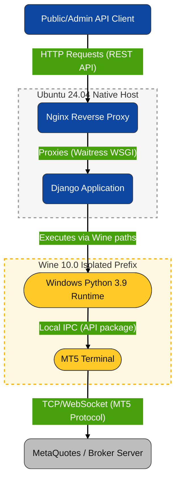

# MT5 + Django Application Server on Ubuntu 24.04

[](https://opensource.org/licenses/MIT)

Running MetaTrader 5 (MT5) on Linux is notoriously difficult. The terminal frequently crashes under Wine due to aggressive anti-debugger protections, and the official `MetaTrader5` Python integration is strictly limited to Windows environments.

This repository provides a battle-tested, production-ready blueprint to bypass these limitations. By strictly locking the Wine version and deploying a native Windows Python runtime *inside* the Wine prefix, this architecture securely bridges the MT5 terminal with a Django API on a headless Ubuntu 24.04 server.

The result is a highly resilient market data server and execution endpoint that exposes MT5 functionality via standard web protocols, fully automated and supervised by systemd.



## Table of Contents

- [Architecture Overview](#architecture-overview)
- [Part 1: Server Provisioning & Security](#part-1-server-provisioning--security)
  - [1. SSH as Root and Create the User](#1-ssh-as-root-and-create-the-user)
  - [2. Transfer SSH Keys to the New User](#2-transfer-ssh-keys-to-the-new-user)
  - [3. Verify the Secure Login](#3-verify-the-secure-login)
- [Part 2: GUI & VNC Automation](#part-2-gui--vnc-automation)
  - [1. Install Desktop and VNC Components](#1-install-desktop-and-vnc-components)
  - [2. Set the VNC Password](#2-set-the-vnc-password)
  - [3. Configure the VNC Startup Script](#3-configure-the-vnc-startup-script)
  - [4. Test the GUI Setup (Optional but Recommended)](#4-test-the-gui-setup-optional-but-recommended)
- [Part 3: The Wine & MT5 Quirks (Crucial Fixes)](#part-3-the-wine--mt5-quirks-crucial-fixes)
  - [1. Install Locked Version of Wine 10.0](#1-install-locked-version-of-wine-100)
  - [2. Initialize the MT5 Prefix](#2-initialize-the-mt5-prefix)
  - [3. Manually Install MT5 via VNC](#3-manually-install-mt5-via-vnc)
  - [4. Final MT5 Verification](#4-final-mt5-verification)
- [Part 4: The Windows Python Environment](#part-4-the-windows-python-environment)
  - [1. Install Windows Python (Via VNC)](#1-install-windows-python-via-vnc)
  - [2. Verify the Installation](#2-verify-the-installation)
  - [3. Install Python Libraries via Windows Pip](#3-install-python-libraries-via-windows-pip)
- [Part 5: Project & Production Configuration](#part-5-project--production-configuration)
  - [1. Clone the Repository](#1-clone-the-repository)
  - [2. Configure the `.env` File (The MT5 Path Quirk)](#2-configure-the-env-file-the-mt5-path-quirk)
  - [3. Create the Production Launcher](#3-create-the-production-launcher)
  - [4. Setup Static Files and Nginx](#4-setup-static-files-and-nginx)
- [Part 6: Bulletproof Systemd Automation](#part-6-bulletproof-systemd-automation)
  - [1. Create the VNC Systemd Service](#1-create-the-vnc-systemd-service)
  - [2. Create the MetaTrader 5 Service](#2-create-the-metatrader-5-service)
  - [3. Create the Django App Service](#3-create-the-django-app-service)
  - [4. Enable and Start the Automation](#4-enable-and-start-the-automation)
- [Part 7: Operations & Troubleshooting Cheat Sheet](#part-7-operations--troubleshooting-cheat-sheet)
  - [1. Viewing Live Logs](#1-viewing-live-logs)
  - [2. Managing Services](#2-managing-services)
  - [3. Connecting to the GUI (VNC)](#3-connecting-to-the-gui-vnc)
  - [4. Updating Code & Installing New Packages](#4-updating-code--installing-new-packages)
- [Part 8: API Endpoints Reference](#part-8-api-endpoints-reference)
  - [1. Server Health & Statistics](#1-server-health--statistics)
  - [2. Live Market Data](#2-live-market-data)
  - [3. Recent Price Action (OHLC)](#3-recent-price-action-ohlc)
  - [4. Historical OHLC Data](#4-historical-ohlc-data)
  - [5. Detailed Symbol Metadata](#5-detailed-symbol-metadata)
  - [6. Lightweight Symbol List](#6-lightweight-symbol-list)

## Architecture Overview

This setup employs a specific stack to overcome MT5's environmental constraints while exposing it safely to external services:

- **OS:** Ubuntu 24.04 LTS
- **Virtualization:** Wine 10.0 — *Strictly version-locked to prevent updates that trigger MT5 anti-debugger crashes.*
- **GUI / Remote:** XFCE4 & TigerVNC — *Provides the required virtual framebuffer and lightweight desktop, tunneled securely via SSH.*
- **Runtime Environment:** Windows Python 3.9 — *Runs entirely inside the Wine prefix. This is the only way to utilize the official Windows-only `MetaTrader5` Python package on Linux.*
- **Web Stack:** Django, Waitress (WSGI), Nginx — *Acts as the bridge, exposing internal Python MT5 commands as accessible REST API endpoints (Reverse Proxy).*
- **Automation:** Systemd — *Manages the strict dependency startup sequence and provides auto-recovery of VNC, MT5, and Waitress.*

## Part 1: Server Provisioning & Security

When you spin up a fresh server (e.g., via Linode, DigitalOcean, or AWS), you initially log in as the root user. Running applications as root is a security risk. In this phase, we create a dedicated user for our deployment and configure secure, passwordless SSH access.

- Theory Note: Why copy SSH keys?
When your cloud provider provisions the server, they inject your public SSH key exclusively into the root user's directory. By creating a new user, that user has no SSH keys and will prompt for a password. We copy the keys from root to ensure your new user has the same secure, instant access.

### 1. SSH as Root and Create the User

SSH into your fresh server using your terminal:

```Bash
ssh root@[SERVER_IP_ADDRESS]
```

Create your new user (replace [YOUR_USERNAME] with your preferred name) and grant them administrative (sudo) privileges:

```Bash
adduser [YOUR_USERNAME]
usermod -aG sudo [YOUR_USERNAME]
```

### 2. Transfer SSH Keys to the New User

While still logged in as root, switch into the context of your new user to copy the authorized SSH keys over and set the strict file permissions required by the SSH daemon:

```Bash
# Switch to the new user account
su - [YOUR_USERNAME]

# Create the SSH directory
mkdir -p ~/.ssh

# Copy the keys from the root directory using sudo
sudo cp /root/.ssh/authorized_keys ~/.ssh/

# Take ownership of the copied files
sudo chown -R $USER:$USER ~/.ssh

# Lock down file permissions for security
chmod 700 ~/.ssh
chmod 600 ~/.ssh/authorized_keys
```

### 3. Verify the Secure Login

Log completely out of the server:

```Bash
exit   # Exits the 'su' user session
exit   # Exits the 'root' SSH session
```

Now, SSH back into the server using your new user account:

```Bash
ssh [YOUR_USERNAME]@[SERVER_IP_ADDRESS]
```

You should be logged in instantly without being prompted for a password.

## Part 2: GUI & VNC Automation

MetaTrader 5 is a Windows application that fundamentally requires a graphical environment to render its windows, even if no human is looking at a monitor. Because Ubuntu Server is "headless" (command-line only), we must install a lightweight desktop environment and a virtual display server.

- Theory Note: Why `XFCE4` and `TigerVNC`?
`XFCE4` is an extremely lightweight desktop that uses very little RAM, leaving more resources for the MT5 terminal and Django application. TigerVNC creates a "virtual monitor" (a VNC session) running entirely in the background. Later, we will tell Wine to draw MT5 exclusively on this virtual monitor.

### 1. Install Desktop and VNC Components

We use the `DEBIAN_FRONTEND=noninteractive` flag to prevent the Ubuntu package manager from throwing up full-screen purple prompts that interrupt the installation.

Run this entire block to update the server and install the GUI packages:

```bash
export DEBIAN_FRONTEND=noninteractive

# Update system repositories and upgrade existing packages
sudo apt-get update && sudo apt-get upgrade -y

# Install the lightweight desktop and VNC server
sudo apt-get install -y xfce4 xfce4-goodies tigervnc-standalone-server dbus-x11
```

### 2. Set the VNC Password

You must set a password to secure your VNC session. Run the following command:

```bash
vncpasswd
```

- **Prompt 1:** Enter your desired password. (Note: VNC passwords are strictly limited to a maximum of 8 characters).

- **Prompt 2:** Verify the password.
- **Prompt 3:** "Would you like to enter a view-only password?" Type **`n`** and press Enter.

### 3. Configure the VNC Startup Script

When the VNC server starts, it needs to know which desktop environment to load. We define this in the `xstartup` file.

Run this block exactly as written to generate the file and make it executable:

```bash
# Ensure the .vnc directory exists
mkdir -p ~/.vnc

# Write the startup configuration
cat << 'EOF' > ~/.vnc/xstartup
#!/bin/sh
unset SESSION_MANAGER
unset DBUS_SESSION_BUS_ADDRESS
/usr/bin/dbus-launch --exit-with-session /usr/bin/startxfce4
EOF

# Make the script executable
chmod +x ~/.vnc/xstartup
```

### 4. Test the GUI Setup (Optional but Recommended)

Before proceeding to Wine, it is best to verify that your virtual desktop works.

1. Start a manual VNC session on your server:

   ```bash
   vncserver -localhost -geometry 1920x1080 :1
   ```

2. On your **local machine**, open a new terminal and create an SSH tunnel (replace placeholders accordingly):

   ```bash
   ssh -f -L 5901:localhost:5901 -N [YOUR_USERNAME]@[SERVER_IP_ADDRESS]
   ```

3. Open a VNC Viewer (like Remmina on Ubuntu) on your local machine and connect to: `localhost:5901`
4. If you see the XFCE desktop environment, it works! Close the viewer, and kill the test session on your server:

   ```bash
   vncserver -kill :1
   ```

## Part 3: The Wine & MT5 Setup

MetaTrader 5 is notoriously hostile to virtualization and uses aggressive anti-debugging software. If we install the absolute latest version of Wine (e.g., Wine 11.0+), MT5 will detect the translation layer as a "debugger" and immediately crash with the error: *"A debugger has been found running in your system."*

To solve this, we must **force-install Wine 10.0** and "hold" the package so Ubuntu's automatic updater never breaks your setup in the future.

- Theory Note: What is a `WINEPREFIX`?
Instead of using the default `~/.wine` directory, we will create an isolated environment at `~/.mt5`. Think of a WINEPREFIX as an isolated virtual `C:\` drive. By keeping MT5 and Python in their own prefix, we prevent conflicts with any other Windows apps you might run on the server.

### 1. Install Locked Version of Wine 10.0

Run this block in your SSH terminal to add the official WineHQ repositories and install the exact version required for Ubuntu 24.04 (Noble):

```bash
# Enable 32-bit architecture (Required by Wine)
sudo dpkg --add-architecture i386

# Download and add the official WineHQ repository key
sudo mkdir -pm 755 /etc/apt/keyrings
sudo wget -O /etc/apt/keyrings/winehq-archive.key https://dl.winehq.org/wine-builds/winehq.key

# Add the WineHQ repository for Ubuntu 24.04 (Noble)
sudo wget -NP /etc/apt/sources.list.d/ https://dl.winehq.org/wine-builds/ubuntu/dists/noble/winehq-noble.sources

# Update package lists
sudo apt-get update

# Install the strictly locked 10.0 version
sudo apt-get install -y winehq-stable=10.0.0.0~noble-1 \
                        wine-stable=10.0.0.0~noble-1 \
                        wine-stable-amd64=10.0.0.0~noble-1 \
                        wine-stable-i386=10.0.0.0~noble-1

# CRITICAL: Prevent Ubuntu from auto-upgrading Wine in the future
sudo apt-mark hold winehq-stable wine-stable wine-stable-amd64 wine-stable-i386
```

#### Fixing WineHQ Installation Errors on Ubuntu 24.04 (Noble) and beyond

**The Problem:**
When running the standard WineHQ installation commands on Ubuntu 24.04, `apt update` sometimes fails with `unsupported filetype` and `NO_PUBKEY` errors. This happens because newer versions of Ubuntu enforce stricter repository security, rejecting plain `.key` files in favor of binary `.gpg` formats.

**The Solution:**
If that happens, we must remove the old `.key` format, convert the WineHQ key into a `.gpg` binary using `gpg --dearmor`, and use a standard `.list` fileas follows:

Replace your existing installation steps with the following block:

```bash
# 1. Clean up any broken files from previous attempts
sudo rm -f /etc/apt/keyrings/winehq-archive.key /etc/apt/sources.list.d/winehq-noble.sources

# 2. Download the key and convert it to the required .gpg format
sudo mkdir -pm 755 /etc/apt/keyrings
curl -fsSL https://dl.winehq.org/wine-builds/winehq.key | sudo gpg --dearmor -o /etc/apt/keyrings/winehq-archive.gpg

# 3. Add the properly formatted WineHQ repository for Ubuntu 24.04 (Noble)
echo "deb [signed-by=/etc/apt/keyrings/winehq-archive.gpg] https://dl.winehq.org/wine-builds/ubuntu/ noble main" | sudo tee /etc/apt/sources.list.d/winehq.list

# 4. Update package lists
sudo apt update

# 5. Install the strictly locked 10.0 version
sudo apt install -y --install-recommends winehq-stable=10.0.0.0~noble-1 \
    wine-stable=10.0.0.0~noble-1 \
    wine-stable-amd64=10.0.0.0~noble-1 \
    wine-stable-i386=10.0.0.0~noble-1

# 6. CRITICAL: Prevent Ubuntu from auto-upgrading Wine in the future              
sudo apt-mark hold winehq-stable wine-stable wine-stable-amd64 wine-stable-i386
```

With this fix, the installation process must flow flawlessly.

### 2. Initialize the MT5 Prefix

Now we create the virtual C: drive and tell it to impersonate Windows 10. Run this in your SSH terminal:

```bash
WINEARCH=win64 WINEPREFIX=~/.mt5 winecfg -v=win10
```

*Note: You will see a lot of "fixme" and "err" text in the terminal. This is standard Wine noise and completely normal. If graphical prompts pop up asking you to install "Wine Mono" or "Wine Gecko", click **Install** on all of them. Close the configuration window once it appears.*

### 3. Manually Install MT5 via VNC

Because the MetaTrader 5 installer uses a graphical wizard, **you must run the installation from inside your VNC desktop.**

1. Start your VNC server (if it isn't running):

   ```bash
   vncserver -localhost -geometry 1920x1080 :1
   ```

2. Connect to the VNC session using your local viewer (e.g., Remmina connected to `localhost:5901` via SSH tunnel).
3. Inside the VNC desktop, click the **Applications** menu at the top left and open **Terminal Emulator**.
4. In that VNC terminal, download the installer:

   ```bash
   wget -O mt5setup.exe https://download.mql5.com/cdn/web/metaquotes.software.corp/mt5/mt5setup.exe
   ```

5. Run the installer inside your WINEPREFIX:

   ```bash
   WINEPREFIX=~/.mt5 wine mt5setup.exe
   ```

Follow the graphical installation wizard. Uncheck "Open MQL5.community website" if prompted. Once it finishes, MT5 will launch.

### 4. Final MT5 Verification

1. Log into your broker account in the MT5 terminal.
2. **Crucial:** Ensure the **"Save password"** box is checked so the headless service can log in automatically later.
3. Close the MetaTrader 5 application completely.
4. Kill the manual VNC session from your SSH terminal:

   ```bash
   vncserver -kill :1
   ```

## Part 4: The Windows Python Environment

- Theory Note: Why Windows Python on a Linux Server?
The official `MetaTrader5` Python package is built exclusively for Windows. It communicates with the `terminal64.exe` process using Windows-native inter-process communication (IPC) and `.dll` files. A standard Linux Python installation cannot use this library. Therefore, we must install a Windows version of Python 3.9+ directly *inside* the Wine prefix alongside MT5.

### 1. Install Windows Python (Via VNC)

Just like the MT5 installer, the Python installer has a graphical interface. **You must perform these steps from the Terminal Emulator inside your VNC desktop.**

1. Start your VNC server from your SSH terminal (if it isn't running):

   ```bash
   vncserver -localhost -geometry 1920x1080 :1
   ```

2. Connect to the VNC session using your local viewer.
3. Open the **Terminal Emulator** inside the VNC desktop and download Python 3.9.13 (a highly stable version fully compatible with the MT5 library):

   ```bash
   wget https://www.python.org/ftp/python/3.9.13/python-3.9.13-amd64.exe
   ```

4. Run the installer inside your WINEPREFIX:

   ```bash
   WINEPREFIX=~/.mt5 wine python-3.9.13-amd64.exe
   ```

**CRITICAL INSTALLATION INSTRUCTIONS (Follow Exactly):**
When the Python installer window appears on your VNC screen:

1. At the very bottom, check the box: **"Add Python 3.9 to PATH"**.
2. Click **"Customize installation"** (Do *not* click the default "Install Now").
3. On the "Optional Features" screen, leave everything checked and click **Next**.
4. On the "Advanced Options" screen, check the box at the very top: **"Install for all users"**.
   *(Notice that checking this box changes the installation path at the bottom to `C:\Program Files\Python39`. This exact path is required for our automation scripts).*
5. Click **Install**. Close the window when it finishes.

### 2. Verify the Installation

Switch back to your standard **SSH terminal** and run this command to verify Python is accessible at the expected Windows path:

```bash
WINEPREFIX=~/.mt5 wine "C:\Program Files\Python39\python.exe" --version
```

*Expected output: `Python 3.9.13`*

### 3. Install Python Libraries via Windows Pip

Now we must install the project's dependencies using the `pip.exe` that belongs to the Windows Python we just installed. This ensures the libraries are placed securely inside the Wine environment.

Run this block in your **SSH terminal**:

```bash
WINEPREFIX=~/.mt5 wine "C:\Program Files\Python39\Scripts\pip.exe" install \
    django \
    djangorestframework \
    django-cors-headers \
    waitress \
    python-dotenv \
    pandas \
    pytz \
    MetaTrader5
```

*(Note: You will see standard Wine noise followed by standard pip download progress bars. A yellow warning advising you to upgrade pip can be safely ignored).*

## Part 5: Project & Production Configuration

In this phase, we will clone the Django application onto the server, configure its environment variables specifically for the Wine runtime, and set up a production-grade web stack using Waitress and Nginx.

- Theory Note: Waitress vs. runserver**
Django's default `manage.py runserver` is single-threaded and explicitly insecure for production. We use **Waitress** because it is a pure-Python WSGI server that is fully supported on Windows (and therefore runs perfectly inside our Wine Python environment). Nginx sits in front of Waitress to securely handle web traffic and serve static files (like CSS/JS).

### 1. Clone the Repository

Log into the server via the standard SSH terminal and clone the project repository:

```bash
# Create a projects directory
mkdir -p ~/projects
cd ~/projects

# Clone your GitHub repository (Replace with your actual URL)
git clone https://github.com/your-username/[YOUR_REPO_NAME].git
cd [YOUR_REPO_NAME]
```

### 2. Configure the `.env` File (The MT5 Path Quirk)

Create a `.env` file in the root of your cloned repository.

**CRITICAL FIX:** When the `MetaTrader5` Python library initializes under Windows, it usually finds the terminal automatically. **Under Wine**, if you do not explicitly provide the internal Windows path to `terminal64.exe`, the library gets confused and will attempt to silently launch a *second, broken instance* of MT5 in the background instead of connecting to your VNC session.

```bash
nano .env
```

Add the following configuration (update with your actual broker credentials and secret key):

```env
# MT5 Account Credentials Obtained from the Broker
MT5_LOGIN=YourLoginCredentials
MT5_PASSWORD=YourActualPassword
MT5_SERVER=YourBrokerServerAddress(e.g. Pepperstone-Demo)

# Timezone
MT5_TIMEZONE=Etc/UTC

# CRITICAL FOR WINE: The internal Windows path to the executable
MT5_PATH=C:/Program Files/MetaTrader 5/terminal64.exe

# Django Settings
MT5_DJANGO_SECRET_KEY=your_secure_secret_key_here
MT5_DEBUG=False
```

*(Save and exit nano by pressing `Ctrl+X`, then `Y`, then `Enter`).*

### 3. Create the Production Launcher

Inside your project root, create a file named `run_waitress.py`. This script acts as the bridge between your Django application and the Waitress production server.

```bash
cat << 'EOF' > run_waitress.py
import os, sys
from waitress import serve

# Add the current directory to the Python path
BASE_DIR = os.path.dirname(os.path.abspath(__file__))
sys.path.append(BASE_DIR)

# Point to your Django settings module (change 'core.settings' if your project folder is named differently)
os.environ.setdefault('DJANGO_SETTINGS_MODULE', 'core.settings')

from django.core.wsgi import get_wsgi_application
application = get_wsgi_application()

print("--- Starting Waitress server on http://127.0.0.1:8000 ---")
serve(application, host='127.0.0.1', port=8000)
EOF
```

### 4. Setup Static Files and Nginx

Nginx needs to know where your static files (like the Django Admin CSS) are located. Ensure your `settings.py` file has `STATIC_ROOT` defined at the bottom:

```python
# In your settings.py
import os
STATIC_ROOT = os.path.join(str(BASE_DIR), 'static')
```

**Run collectstatic:**
Use your Wine Python environment to gather the static files into that folder:

```bash
WINEPREFIX=~/.mt5 wine "C:\Program Files\Python39\python.exe" manage.py collectstatic --noinput
```

**Install and Configure Nginx:**
Run this entire block to install Nginx, set up the reverse proxy, and fix user permissions so Nginx can read the static files in your home directory.

```bash
# Install Nginx
sudo apt-get update
sudo apt-get install -y nginx

# Create the Nginx Site Config (Replace placeholders!)
sudo tee /etc/nginx/sites-available/mt5-django > /dev/null << 'EOF'
server {
    listen 80;
    server_name _; 

    # Route static files
    location /static/ {
        root /home/[YOUR_USERNAME]/projects/[YOUR_REPO_NAME];
    }

    # Route all other traffic to Waitress
    location / {
        include proxy_params;
        proxy_pass http://127.0.0.1:8000;
    }
}
EOF

# Enable the site and disable the default Nginx page
sudo ln -sf /etc/nginx/sites-available/mt5-django /etc/nginx/sites-enabled/
sudo rm -f /etc/nginx/sites-enabled/default

# Grant Nginx read access to your home directory for static files
sudo usermod -a -G $USER www-data
chmod g+x /home/$USER
chmod g+x /home/$USER/projects
chmod g+x /home/$USER/projects/[YOUR_REPO_NAME]

# Test configuration and restart Nginx
sudo nginx -t
sudo systemctl restart nginx
```

## Part 6: Bulletproof Systemd Automation

If the server reboots, everything shuts down. Manually starting the GUI, terminal, and Django app via SSH is tedious and prone to human error. We will use Linux's native `systemd` to automate the boot sequence, monitor the applications, and instantly restart them if they crash.

- Theory Note: The Golden Fix for Wine Hangs (`wineserver -k`)**
When Systemd tries to restart a background Wine process, it sends a standard "stop" signal. However, Wine has a persistent background daemon (`wineserver`) that refuses to die gracefully, causing Systemd to hang indefinitely during a restart. We fix this by explicitly telling Systemd to force-kill the daemon via the `ExecStop` command, guaranteeing clean, lightning-fast restarts.

**IMPORTANT:** In the files below, you must replace `[YOUR_USERNAME]` and `[YOUR_REPO_NAME]` with your actual details.

### 1. Create the VNC Systemd Service

This service spins up the virtual monitor on port `:1` first.

Open the file for editing:

```bash
sudo nano /etc/systemd/system/vncserver@.service
```

Paste the following configuration:

```ini
[Unit]
Description=Start TigerVNC server at startup
After=syslog.target network.target

[Service]
Type=forking
User=[YOUR_USERNAME]
WorkingDirectory=/home/[YOUR_USERNAME]
ExecStartPre=-/usr/bin/vncserver -kill :%i
ExecStart=/usr/bin/vncserver -localhost -geometry 1920x1080 :%i
ExecStop=/usr/bin/vncserver -kill :%i
Restart=on-failure

[Install]
WantedBy=multi-user.target
```

*(Save and exit nano: `Ctrl+X`, then `Y`, then `Enter`).*

### 2. Create the MetaTrader 5 Service

This service waits for VNC to be ready, then launches MT5 into that specific virtual display (`DISPLAY=:1`).

Open the file for editing:

```bash
sudo nano /etc/systemd/system/mt5-terminal.service
```

Paste the following configuration:

```ini
[Unit]
Description=MetaTrader 5 Terminal Service
Wants=vncserver@1.service
After=network.target vncserver@1.service

[Service]
User=[YOUR_USERNAME]
Environment="DISPLAY=:1"
WorkingDirectory=/home/[YOUR_USERNAME]/.mt5/drive_c/Program Files/MetaTrader 5/
ExecStart=/usr/bin/env WINEPREFIX="/home/[YOUR_USERNAME]/.mt5" /usr/bin/wine terminal64.exe
ExecStop=/usr/bin/env WINEPREFIX="/home/[YOUR_USERNAME]/.mt5" /usr/bin/wineserver -k
TimeoutStopSec=15
Restart=always
RestartSec=10

[Install]
WantedBy=multi-user.target
```

*(Save and exit).*

### 3. Create the Django App Service

Because the exact execution path for Wine, Python, and Waitress is long, it is best practice to wrap it in a bash script first.

**A. Create the Bash Wrapper Script:**

```bash
mkdir -p ~/scripts
nano ~/scripts/start-app.sh
```

Paste this code (update placeholders):

```bash
#!/bin/bash
set -e

export WINEPREFIX="/home/[YOUR_USERNAME]/.mt5"
PYTHON_EXE="/home/[YOUR_USERNAME]/.mt5/drive_c/Program Files/Python39/python.exe"
SCRIPT_PATH="/home/[YOUR_USERNAME]/projects/[YOUR_REPO_NAME]/run_waitress.py"

exec /usr/bin/env WINEPREFIX="$WINEPREFIX" /usr/bin/wine "$PYTHON_EXE" "$SCRIPT_PATH"
```

*(Save and exit).*

Make the script executable:

```bash
chmod +x ~/scripts/start-app.sh
```

**B. Create the Systemd Service:**

```bash
sudo nano /etc/systemd/system/mt5-django.service
```

Paste the following configuration:

```ini
[Unit]
Description=Django Application Server (Waitress)
After=network.target mt5-terminal.service
Requires=mt5-terminal.service

[Service]
User=[YOUR_USERNAME]
Environment="DISPLAY=:1"
ExecStart=/home/[YOUR_USERNAME]/scripts/start-app.sh
Restart=always
RestartSec=15

[Install]
WantedBy=multi-user.target
```

*(Save and exit).*

### 4. Enable and Start the Automation

With all three files created, tell systemd to load them, enable them to start on boot, and spin them up right now:

```bash
# Reload systemd cache to read the new files
sudo systemctl daemon-reload

# Enable services to run automatically on server reboot
sudo systemctl enable vncserver@1.service
sudo systemctl enable mt5-terminal.service
sudo systemctl enable mt5-django.service

# Start the services immediately (in order)
sudo systemctl start vncserver@1.service
sudo systemctl start mt5-terminal.service
sudo systemctl start mt5-django.service
```

If everything was configured correctly, your API is now live, and your background MetaTrader 5 terminal is fully manageable by standard Linux commands!

## Part 7: Operations & Troubleshooting Cheat Sheet

Now that the headless MT5 and Django API are running in production, you will use standard Linux commands to monitor and maintain them.

### 1. Viewing Live Logs

Because we used `systemd`, all `print()` statements from your Python code, Django errors, and MT5 terminal logs are captured securely by the Linux journal.

**View Django API Logs (Live):**

```bash
sudo journalctl -u mt5-django.service -f
```

*(Press `Ctrl+C` to exit the live log viewer).*

**View MT5 Terminal Service Logs:**

```bash
sudo journalctl -u mt5-terminal.service -f
```

**View Nginx Web Traffic/Error Logs:**

```bash
sudo journalctl -u nginx -f
```

### 2. Managing Services

If your broker connection drops, or if you push new Django code, you will need to restart the corresponding service.

**Restart MetaTrader 5 (Fixes dropped broker connections):**

```bash
sudo systemctl restart mt5-terminal.service
```

*(Because of our `wineserver -k` fix in Part 6, this will cleanly force-kill the hidden Wine process and spin up a fresh MT5 instance in about 15 seconds).*

**Restart Django (Required after code updates):**

```bash
sudo systemctl restart mt5-django.service
```

### 3. Connecting to the GUI (VNC)

If you need to visually inspect the charts, check Expert Advisors, or log into a new broker account, you can tap into the background virtual monitor securely from your local computer.

**From your local machine terminal:**

```bash
ssh -f -L 5901:localhost:5901 -N [YOUR_USERNAME]@[SERVER_IP_ADDRESS]
```

Then, open your VNC Viewer (e.g., Remmina) and connect to: `localhost:5901`

### 4. Updating Code & Installing New Packages

When you update your Django project on GitHub, follow this sequence to deploy the changes to your server:

**Pulling New Code:**

```bash
cd ~/projects/[YOUR_REPO_NAME]
git pull origin main
```

**Installing New Python Dependencies (If added to requirements):**
Always use the exact path to the Windows `pip.exe` inside your Wine prefix:

```bash
WINEPREFIX=~/.mt5 wine "C:\Program Files\Python39\Scripts\pip.exe" install [PACKAGE_NAME]
```

**Gathering New Static Files (If you changed CSS/JS):**

```bash
WINEPREFIX=~/.mt5 wine "C:\Program Files\Python39\python.exe" manage.py collectstatic --noinput
```

**Apply Changes:**

```bash
sudo systemctl restart mt5-django.service
```

## Part 8: API Endpoints Reference

The Django application exposes several RESTful endpoints to interact with the MetaTrader 5 terminal. All endpoints use the `GET` method and return JSON payloads.

**Base URL:** `http://[SERVER_IP_ADDRESS]/api/`

---

### 1. Server Health & Statistics

**Endpoint:** `/stat/`  
**Method:** `GET`  
**Description:** A comprehensive health-check endpoint that returns both the physical Linux server statistics (RAM, CPU, Uptime) via Wine mapping, and the live MetaTrader 5 account status (Balance, Margin, Open Positions, Algo Status).

**Parameters:** None

**Example Response:**

```json
{
  "status": "healthy",
  "timestamp": "2024-05-10T12:00:00.000000",
  "mt5": {
    "connected": true,
    "broker": "Pepperstone",
    "balance": 10000.0,
    "floating_profit": 45.50,
    "algo_trading_allowed": true,
    "open_positions_count": 2
  },
  "server": {
    "ram_total_mb": 2048.0,
    "ram_used_mb": 512.0,
    "cpu_load_avg": ["0.01", "0.05", "0.00"],
    "uptime_days": 14.5
  }
}
```

---

### 2. Live Market Data

**Endpoint:** `/live/`  
**Method:** `GET`  
**Description:** Retrieves live pricing and session data. Can be used to fetch a single symbol in detail, or a "live board" of all available symbols at once.

**Parameters:**

| Parameter | Type | Required | Description |
| :--- | :--- | :--- | :--- |
| `symbol` | String | No | The specific ticker symbol (e.g., `EURUSD`). If omitted, returns an array of all symbols. |

**Example Response (With `?symbol=EURUSD`):**

```json
{
  "symbol": "EURUSD",
  "bid": 1.08542,
  "ask": 1.08544,
  "session_open": 1.08200,
  "swap_long": -4.5,
  "swap_short": 1.2,
  "timestamp": "2024-05-10T12:00:00.000000"
}
```

---

### 3. Recent Price Action (OHLC)

**Endpoint:** `/recent/`  
**Method:** `GET`  
**Description:** Retrieves the most recent candlesticks (Open, High, Low, Close) for a symbol, counting backwards from the current live price.

**Parameters:**

| Parameter | Type | Required | Description |
| :--- | :--- | :--- | :--- |
| `symbol` | String | Yes | The ticker symbol (e.g., `BTCUSD`). |
| `timeframe` | String | Yes | MT5 timeframe (e.g., `M1`, `M15`, `H1`, `D1`). |
| `count` | Integer | No | Number of recent candles to retrieve. Default is `100`. |

**Example Request:** `/recent/?symbol=XAUUSD&timeframe=H1&count=5`

---

### 4. Historical OHLC Data

**Endpoint:** `/history/`  
**Method:** `GET`  
**Description:** Retrieves historical candlestick data between two specific dates.

**Parameters:**

| Parameter | Type | Required | Description |
| :--- | :--- | :--- | :--- |
| `symbol` | String | Yes | The ticker symbol (e.g., `AAPL`). |
| `timeframe` | String | Yes | MT5 timeframe (e.g., `M5`, `H4`). |
| `from` | String | Yes | Start date in ISO 8601 format (e.g., `2024-01-01T00:00:00`). |
| `to` | String | Yes | End date in ISO 8601 format. |

---

### 5. Detailed Symbol Metadata

**Endpoint:** `/symbols/all/`  
**Method:** `GET`  
**Description:** Returns a detailed list of all tradeable instruments available on the broker account, including their structural hierarchy (Class/Group) and digit precision.

**Parameters:** None

**Example Response:**

```json
{
  "count": 1200,
  "symbols":[
    {
      "name": "EURUSD",
      "description": "Euro vs US Dollar",
      "class": "Forex",
      "group": "Majors",
      "digits": 5,
      "point": 0.00001
    }
  ],
  "timestamp": "2024-05-10T12:00:00.000000"
}
```

---

### 6. Lightweight Symbol List

**Endpoint:** `/symbols/names/`  
**Method:** `GET`  
**Description:** A lightweight endpoint returning a flat array of all supported symbol names. Highly optimized for populating frontend dropdowns or UI lists without heavy metadata.

**Parameters:** None

**Example Response:**

```json
{
  "count": 1200,
  "symbols":[
    "EURUSD",
    "GBPUSD",
    "USDJPY",
    "BTCUSD"
  ],
  "timestamp": "2024-05-10T12:00:00.000000"
}
```
